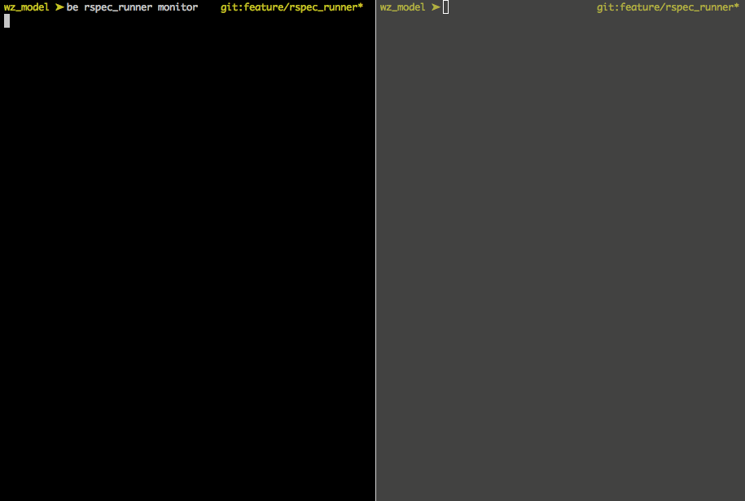

# RspecRunner

## Usage



Run `monitor`:

    $ bundle exec rspec_runner monitor

It runs `monitor`, which preloads dependencies and shows test results with RSpec.
It also tracks file changes with [listen](https://github.com/guard/listen/) and automatically reloads dependencies if necessary.
Similar to [spork](https://github.com/sporkrb/spork) it forks a new process but only if files have changed.

Run your test:

    $ bundle exec rspec_runner spec/models/account_spec.rb:3

It connects to `monitor` through DRb and executes tests.

## Installation

Add this line to your application's Gemfile:

```ruby
gem 'rspec_runner', require: false
```

And then execute:

    $ bundle

## Configuration

To customize RspecRunner you have to add `spec/rspec_runner.rb` file with the following content:

```ruby
# Default config

RspecRunner.configure do |config|
  config.uri_filepath = 'tmp/rspec_runner'
  config.client_timeout = 60 # seconds

  config.listen_directories = [Dir.pwd]
  config.listen_options = { # https://github.com/guard/listen#options
    only: /\.rb$/,
    ignore: /spec\/.+_spec\.rb$/,
    wait_for_delay: 1
  }
end
```

## Development

After checking out the repo, run `bin/setup` to install dependencies. Then, run `rake false` to run the tests.

To install this gem onto your local machine, run `bundle exec rake install`. To release a new version, update the version number in `version.rb`, and then run `bundle exec rake release`, which will create a git tag for the version, push git commits and tags, and push the `.gem` file to [rubygems.org](https://rubygems.org).

## Contributing

Bug reports and pull requests are welcome on GitHub at https://github.com/[USERNAME]/rspec_runner. This project is intended to be a safe, welcoming space for collaboration, and contributors are expected to adhere to the [Contributor Covenant](contributor-covenant.org) code of conduct.

## TODO

* Try to kill a process without `kill -9`
* Add tests!
* Speedup client

## License

The gem is available as open source under the terms of the [MIT License](http://opensource.org/licenses/MIT).

